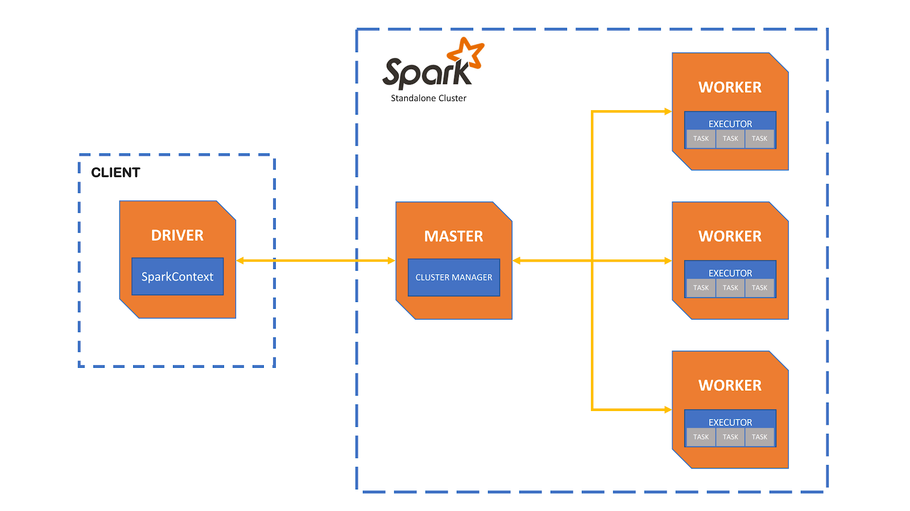
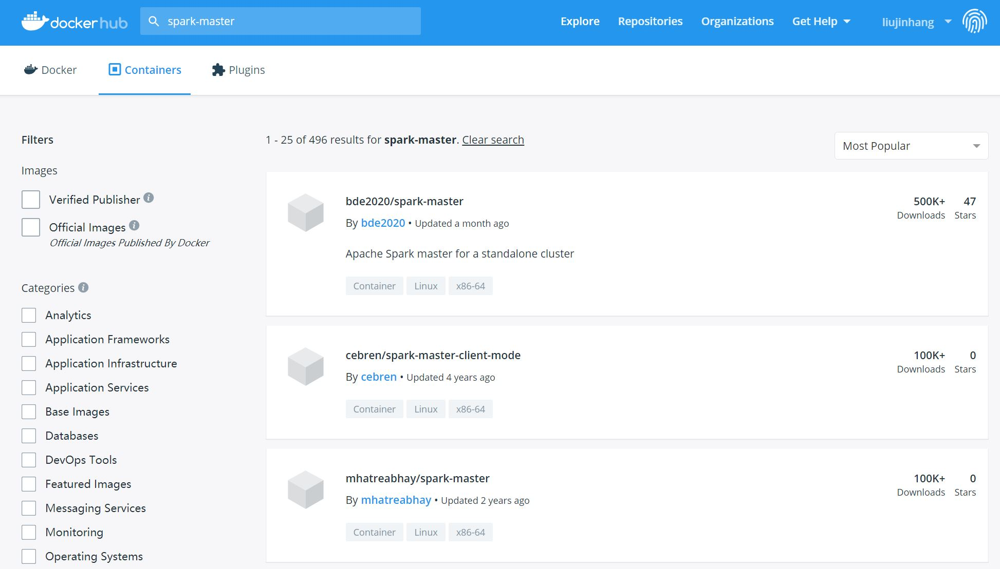
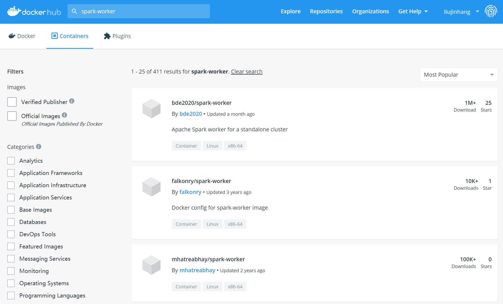

# 使用docker构建spark运行环境

## 安装docker与docker-compose

请参考之前的实验。

docker-compose已经在files文件夹内部。

将其拷贝到`/usr/local/bin/`内部并给予执行权限。

## 系统构架图：



使用docker hub查找我们需要的镜像。





## docker compose部署文件：

```

version: '3'

services:
  spark-master:
    image: bde2020/spark-master
    container_name: spark-master
    ports:
      - "8080:8080"
      - "7077:7077"
    volumes:
      - <共享目录绝对路径>:/data
    environment:
      - INIT_DAEMON_STEP=setup_spark
      
  spark-worker-1:
    image: bde2020/spark-worker
    container_name: spark-worker-1
    depends_on:
      - spark-master
    ports:
      - "8081:8081"
    volumes:
      - <共享目录绝对路径>:/data
    environment:
      - "SPARK_MASTER=spark://spark-master:7077"
      
  spark-worker-2:
    image: bde2020/spark-worker:3.1.1-hadoop3.2
    container_name: spark-worker-2
    depends_on:
      - spark-master
    ports:
      - "8082:8081"
    volumes:
      - <共享目录绝对路径>:/data
    environment:
      - "SPARK_MASTER=spark://spark-master:7077"

```

## 使用yml部署文件部署spark环境

在yml文件所在的目录下，执行命令：

`
sudo docker-compose up -d
`

检查docker在命令行的输出确认容器的部署顺利完成。


查看容器创建与运行状态

`
sudo docker ps
`

对输出进行格式化

`
sudo docker ps --format '{{.ID}} {{.Names}}'
`

使用浏览器查看master的web ui界面


进入spark-master容器

`
sudo docker exec -it <master容器的id，仅需输入一部分即刻> /bin/bash
`

查询spark环境，安装在/spark下面。

`
ls /spark/bin
`

进入spark-shell

`
/spark/bin/spark-shell --master spark://spark-master:7077 --total-executor-cores 8 --executor-memory 2560m
`

进入浏览器查看spark-shell的状态


# 完成创建RDD与filter处理的实验

创建一个RDD

`
val rdd=sc.parallelize(Array(1,2,3,4,5,6,7,8))
`

打印rdd内容

`
rdd.collect()
`

查询分区数

`
rdd.partitions.size
`

选出大于5的数值

`
val rddFilter=rdd.filter(_ > 5)
`

打印rddFilter内容

`
rddFilter.collect()
`

退出spark-shell

`
:quit
`