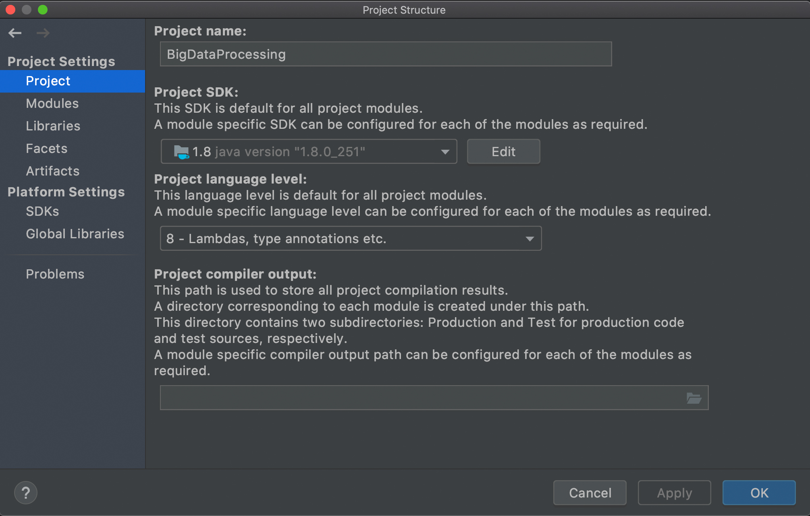
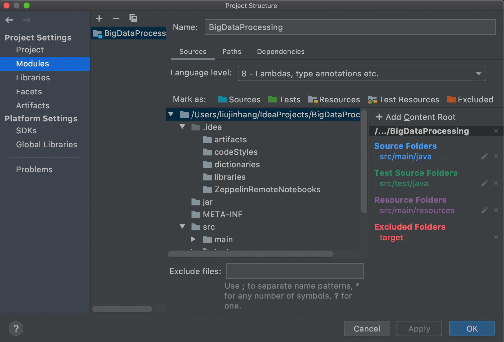
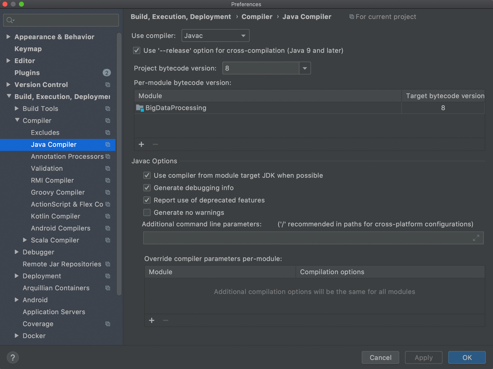

# 基于hadoop与MapReduce的分布式编程

在上一章中，我们使用docker构建了Hadoop的分布式环境镜像，并使用`docker run`命令从该镜像中部署了一主两从的三个分布式节点：master、worker01、worker02。

部署命令如下：

```
sudo docker run -p 8088:8088 -p 9000:9000 -v /home/ryu/Documents/hadoop/master/share:/root/share -it -h master --name master ubuntu/hadoop_3.2.1_cluster_tested

sudo docker run -v /home/ryu/Documents/hadoop/worker01/share:/root/share -it -h worker01 --name worker01 ubuntu/hadoop_3.2.1_cluster_tested

sudo docker run -v /home/ryu/Documents/hadoop/worker02/share:/root/share -it -h worker02 --name worker02 ubuntu/hadoop_3.2.1_cluster_tested
```

在端口映射上，需要打开`9000`端口，方便客户端访问分布式文件系统HDFS。

另外，`8088`端口为Hadoop的应用程序web界面，打开后可以通过web查看应用程序与节点的状态。

通过`docker run`命令部署仍然稍显麻烦，下一节将介绍使用docker-compose部署容器的方法。

## 通过docker-compose部署容器

### 安装docker-compose

查询docker版本号。

在host上执行。

`sudo docker -v`

根据查询到的版本号，在下列网站找到对应的docker-compose版本。

https://github.com/docker/compose/releases

这里，我们使用最新的1.25.5版本。

执行下列命令，安装docker-compose。

docker-compose为单一可执行文件，将其放到`/usr/local/bin`中，给予文件执行权限即可使用。

```
sudo curl -L "https://github.com/docker/compose/releases/download/1.25.5/docker-compose-$(uname -s)-$(uname -m)" -o /usr/local/bin/docker-compose

sudo chmod +x /usr/local/bin/docker-compose
```

或者通过下列网址下载：

https://github.com/docker/compose/releases

### 编写docker-compose.yml文件

docker-compose.yml将通过配置的方式代替`docker run`冗长的参数。

具体请参考目录下的docker-compose.yml。

### 根据docker-compose.yml文件部署镜像

进入docker-compose.yml的目录。

`sudo docker-compose up -d`

通过docker exec命令可以进入启动容器的交互界面。

```
sudo docker exec -it master bash

sudo docker exec -it worker01 bash

sudo docker exec -it worker02 bash
```

再次部署容器时，必须删除上一次部署的容器（container）与网络（network）。

在删除容器之前，需要先停止容器。

`sudo docker stop <contain id>`

Q: 执行部署容器后，产生错误信息：

`Pool overlaps with other one on this address space`

A: 相同名称的network以及定义，通过以下命令，查询并删除同名network

```
sudo docker network ls

sudo docker network rm <network id>
```

Q: 如何删除所有已经退出的容器。

A: sudo docker container prune

## 基于JAVA的MapReduce分布式编程

检查java环境。

`java -version`

当前Hadoop的版本号为`3.2.1`，支持的JDK版本号为`8(1.8)`。

JAVA编程环境所用的JDK/JRE版本号必须与Hadoop环境的JDK/JRE版本号一致。







参考代码：https://github.com/hbut-edu/BigDataProcessing

在非RPC模式下，代码和数据的传递方式有所不同。

假设开发环境位于host，那么：

代码：host环境下编译生成JAR包，需要通过共享文件夹将JAR包传到master容器内部。

数据：防止在host环境下的数据文件可以直接通过HDFS的API上传至HDFS内部。

运行：

`./bin/hadoop jar <path-to-jar>/BigDataProcessing.jar`

## 基于Hadoop Streaming与Python的MapReduce分布式编程

Hadoop MapReduce不仅可以使用JAVA进行编程。借助于标准输入输出机制（STDIN/STDOUT）与Hadoop Streaming库可以与几乎所有语言进行连接。

Python是大数据处理领域流行的编程语言，本节将介绍如何使用Python编写MapReduce算法，以及如何提交给Hadoop处理。

# 检查运行环境

`ls ./share/hadoop/tools/hadoop-streaming-3.2.1.jar`

# 使用Python编写MapReduce代码

参考目录：`BigDataProcessingStreaming`

`https://github.com/hbut-edu/big-data-processing/tree/master/BigDataProcessingStreaming`

在基于Hadoop Streaming的MapReduce编程中，输入为标准输入STDIN，输出为标准输出STDOUT。

# 执行MapReduce

```
./bin/hadoop jar ./share/hadoop/tools/lib/hadoop-streaming-3.2.1.jar \
-files /root/share/BigDataProcessingStreaming/mapper.py,/root/share/BigDataProcessingStreaming/reducer.py \
-input "/input/training_data.csv" \
-output "/output" \
-mapper "python3 mapper.py" \
-reducer "python3 reducer.py"
```

说明：

和JAVA一样，在使用Hadoop Streaming的时候请注意python代码同样需要事先通过共享文件夹上传到master内部。

示例中，通过`-files`参数指定上传的文件路径。

和JAVA不同的是，Hadoop Streaming不能对HDFS直接通讯，所以需要事先通过`hdfs dfs -put`命令将数据文件上传到HDFS内部。

`-mapper`和`-reducer`参数用于指定执行任务时候的bash命令。

在执行前，可以先检查一下python解释器命令。这里为`python3`。

# Q&A

Q：如何查看输出结果（或HDFS上的文本文件）。

A：使用`cat`命令。

`./bin/hdfs dfs -cat /output/part-00000`

Q：如何删除HDFS上的目录。

A：使用`-rm -r`命令。

`./bin/hdfs dfs -rm -r /output*`

## 实验任务：

### 使用Hadoop平台处理数据集，输出数据集中的异常值。

### 数据集地址

链接:`https://pan.baidu.com/s/1tkQjDlmhzEu7try6gNJgLw`

密码:`66pr`

### 数据集说明（输入）

数据集来源于某地市网络的流量数据，收集了16000+个网元167天的流量数据。

数据集格式：

横坐标为网元数，无header。

纵坐标为天数，无header。

数据中因为采集设备故障等因素有异常值发生。请使用Hadoop与MapReduce以及相关算法计算出每个网元中异常值的数量。

### 输出格式（以网元为单位）

网元1 10

网元2 15

网元3 9

...
